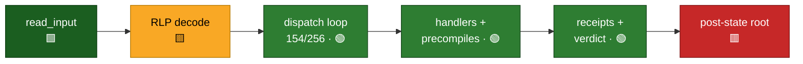

# evm-asm Status Report

**Date:** 2026-06-15  **Commit (main):** `997418acd`

## Executive summary

evm-asm is building a **formally verified EVM state transition function as RISC-V (RV64IM)
macro-assembly**, intended to run as a stateless block-validator guest program inside a zkVM.
The opcode-verification layer remains the most mature: **42 EVM opcodes carry complete,
kernel-checked correctness proofs** (full stack-level Hoare triples), with a trusted base of only
the three standard classical axioms — no `native_decide`/`bv_decide`, no `sorry`. The pure-Lean
**execution layer (EL)** models accounts, storage, transactions, calls, creates and logs,
exercised by a **66-vector conformance suite (55 passing, 11 expected errors, 0 unexpected
failures)**. This cycle the headline movement is **verification depth, not breadth**: the RLP
codec now carries a complete kernel-checked **encode↔decode bijection** (round-trip *and*
injectivity *and* a full right-inverse that rejects non-canonical encodings) — the spec-level
keystone underneath the still-blocked RV64 input decoder — and the **codegen lowering proofs
roughly doubled, from 13 to 26 opcode handler specs**. The **codegen guest** keeps filling in
underneath: the RV64 dispatch loop routes **154 opcode bytes** (100% of the live opcode space),
with child-frame CALL/CREATE descent, a storage journal, real precompiles, and a stateless
block-verdict (BAL/witness-checked) assembly that now spans **970 programs / 728 ziskemu
round-trips**. The honest gap between "verified opcodes" and "verified zkEVM" is unchanged in
shape: of the **9 guest-program obligations, 2 are done, 6 are blocked, and 1 is not started**,
gated on the RV64 RLP input decoder, MPT pre-state verification, and full *verified* opcode
coverage — the codegen guest exists and runs, but it is unverified by design.

## 1. EVM Opcodes

**85 registry entries / 149 opcode bytes** modeled, tracked in a kernel-checked registry
(`EvmAsm/Progress.lean`, CI-gated against drift).

| Tier | Entries | Bytes | Meaning |
|---|---:|---:|---|
| ✅ Proven | 42 | 72 | Complete stack-level Hoare triple, no input restriction |
| 🔶 Conditional | 2 | 2 | Complete triple, gated by an input-domain precondition |
| 🟡 Partial | 6 | 36 | Arithmetic lemma / sub-component only — no full triple yet |
| ⏳ ExecSpec | 32 | 36 | Executable-spec semantics only — no RV64 subroutine |
| ✗ Not started | 3 | 3 | Not yet modeled in the opcode enum |

**Fully proven** spans arithmetic (ADD, SUB, MUL, DIV, SIGNEXTEND), all bitwise
(AND/OR/XOR/NOT), all shifts (SHL/SHR/SAR), all comparisons (LT/GT/SLT/SGT/EQ/ISZERO), BYTE,
and the stack family (POP, PUSH0, DUP1–16, SWAP1–16). **SDIV** and **MOD** have complete triples
gated by an input-domain precondition (🔶 conditional — e.g. MOD's divisor restricted to
`b.getLimbN 3 = 0`, the n=4 limb path uncovered). The remaining arithmetic with hard 256-bit
semantics — **SMOD, MULMOD, ADDMOD, EXP** — plus **CALLDATACOPY** and **PUSH2–32** have verified
`*_correct` arithmetic lemmas or partial-effect specs but not yet a full triple (🟡 partial). The
opcode tiers are unchanged from the previous report; this cycle's verification effort went into
the RLP codec and the codegen lowering layer (see §2, §3).

**Trust base:** every proof is kernel-checkable. `#print axioms` over the witnessed theorems
shows **0 axioms beyond `propext`/`Classical.choice`/`Quot.sound`**; both TCB-expanding tactics
are fully eliminated (`native_decide` 206→0, `bv_decide` 290→0) and the forbidden-tactic and
axiom CI gates keep them out.

## 2. State Transition Function (STF)

The execution layer (`EvmAsm/EL/`, ~180 files) specifies the STF as pure Lean, independent of
RISC-V. Three maturity levels matter and are tracked separately below:

- **Modeled** — data structures / predicates are *defined* (the shape), but no computation runs.
- **Executable** — a computable Lean `def` that actually evaluates.
- **Proven** — theorems establish correctness (mutation/frame lemmas, conformance checks).

| Area | Modeled | Executable | Proven |
|---|---|---|---|
| **World state** (accounts, balance, nonce, code, storage) | `Account`, `WorldState` | get/set account · storage · balance · nonce · code | ✅ read-after-write + field-isolation (frame) lemmas |
| **Transactions** (EIP-1559) | `Transaction`, `validatesAgainst` predicate | intrinsic gas, effective gas price / priority fee, upfront cost, post-exec gas refund | ✅ intrinsic-gas, fee, and refund correctness |
| **Message calls** (CALL/STATICCALL/DELEGATECALL) | `CallKind`, `CallFrame`, `CallResult` | precheck decision (balance / static / depth / stipend), in-exec value transfer, committed-state & output selection | ✅ precheck branches, value-transfer balance preservation |
| **Contract creation** (CREATE/CREATE2) | `CreateKind`, `CreateRequest` | precheck decision (size / balance / nonce / collision), request→address-input | ✅ precheck branch lemmas |
| **Logs** (LOG0–4, EIP-7708 transfer logs) | `LogEntry`, `LogState` | append, topic-count check, full-data capture buffer, synthetic transfer-log descriptors | ✅ append + topic-validity lemmas |
| **RLP codec** (strings + nested lists) | `RLPItem`, `encode` / `decode` / `decodeFully` | full encode + bounded-fuel decode that evaluates | ✅ **encode↔decode bijection** — round-trip, injectivity, canonical right-inverse |
| **Gas schedule** | per-opcode + dynamic (memory / copy / keccak) cost | intrinsic + EXP / calldata / keccak cost helpers | ⚠️ helpers checked by conformance; schedule **not** proven equal to the yellow paper |
| **Block-level STF** | `BlockHeader`, `BlockInput`, `BlockResult` | `BlockTransition.run` — folds txs through an executor | ⚠️ fold laws + empty-block case only |

**Three honest gaps in the chain:**

1. **The call/create executors are abstract hooks, not implementations.** `CallExecutor`
   (message-call execution) and `AddressDeriver` (keccak/RLP address derivation) are
   function-typed *parameters* in the EL. The EL models the shape and invariants around them and
   proves the surrounding bookkeeping; the opcode-driven execution that fills them in lives in
   the Evm64 / codegen layers. So **there is no closed, executable
   `state_transition(block, pre_state) → post_state` in the verified EL** — `BlockTransition.run`
   threads an executor it does not itself provide.
2. **Gas/cost modeling is a verified surrogate, not a proven consensus match.** Per-opcode
   `cpsTripleWithin N` step bounds are proven, but their mapping to the EVM gas schedule is
   *modeled*, not proven equal to the yellow paper (`DRIFT.md`).
3. **Reference semantics are assumed.** Correctness is measured against the pinned
   `ethereum/execution-specs`; that the spec faithfully encodes consensus is assumed, not proven.

**New this cycle — the RLP codec is now a proven bijection.** `EvmAsm/EL/RLP/Properties.lean`
carries a complete, kernel-checked correctness story for the pure-spec codec: `decode_encode`
(decode recovers any encoded item — the round-trip / left inverse), `encode_injective`, and
`decode_right_inverse_mutual` / `decode_eq_some_imp_encode` (decode succeeds **only** on canonical
encodings — the right inverse), with `decodeFully` whole-input variants. This is the spec-level
keystone under guest obligation #3; it does **not** itself ship the RV64 input decoder (that
remains blocked), but it removes the correctness risk from the encoding the decoder must target.

**Conformance — the executable-and-proven evidence.** A kernel-checked suite of **66 vectors
(55 passing, 11 expected errors, 0 unexpected failures)** (`EvmAsm/EL/Conformance/All.lean`, all
counts proven by theorem) runs real EL/Evm64 executables and checks their output by `decide`/`rfl`,
with a CI floor that fails the build on regression. Coverage spans CALL output, calldata, code,
CREATE initcode gas, EXP arithmetic + gas, KECCAK256, LOG data + stack, RLP, return data, signed
arithmetic (SDIV/SMOD edges), storage (SLOAD/SSTORE), and terminating ops (RETURN/REVERT).

**Guest-program obligations (the path to a complete zkEVM):** 9 total — **2 done, 6 blocked, 1
not started** (kernel-checked in `EvmAsm/Progress/Obligations.lean`:
`doneCount = 2`, `blockedCount = 6`, `notStartedCount = 1`).

| # | Obligation | Status |
|---|---|---|
| 2 | `read_input`/`write_output` IO interface | ✅ done |
| 9 | Halt convention (`--halt linux93`) | ✅ done |
| 1 | RV64 ELF on the `zicclsm` target | 🟡 blocked (codegen emits `rv64imac`, one extension off) |
| 3 | RLP-decode the (block, witness) input | 🟡 blocked (RV64 decoder unshipped; spec-level bijection now **proven**) |
| 4 | EVM interpreter loop on the decoded block | 🟡 blocked (see note) |
| 5 | Full opcode coverage with **verified** handlers | 🟡 blocked (partial/execSpec opcodes lack RV64) |
| 6 | Accelerator ECALL bridges (precompiles) | 🟡 blocked (EL bridges not all codegen-wired) |
| 7 | MPT verification of pre-state witnesses | ✗ not started |
| 8 | Verified post-state root → public output | 🟡 blocked (on #4–#7) |

> **Note on #4:** the kernel matrix marks the interpreter-loop obligation `blocked`, and its
> note string (`"codegen M5 … not shipped"`) now lags the codegen track — the M5b
> fetch/decode/dispatch loop shipped (2026-05-19) and routes 154 opcode bytes (see §3). What
> keeps the obligation open is *end-to-end* execution: running a real RLP-decoded block (#3)
> through *verified* handlers for every opcode (#5) and emitting a verified post-state root (#8).

## 3. Codegen

The codegen track turns Lean `Program`s into runnable RISC-V and is assembling a full stateless
block-validator guest. It is **unverified by design** — fenced by round-trip `#guard` tests and
the conformance floor rather than proven — though the lowering-proof frontier is now closing in
on it (26 handler specs, below).

### Codegen at a glance

Legend: 🟩 done · 🟢 shipped & runnable (unverified) · 🟨 in progress · 🟥 blocked · ⬜ not started.

| Codegen capability | Detail | State |
|---|---|---|
| Dispatch loop | 154 / 256 opcode bytes (100% of live space) | 🟢 shipped |
| Core handlers | stack · arith · bitwise · shift · memory · env | 🟢 runnable |
| Storage | SLOAD / SSTORE / TLOAD / TSTORE on log + journal | 🟢 runnable |
| Child frames | CALL\* · CREATE / CREATE2 + init-code interp | 🟢 runnable |
| Precompiles | RIPEMD160 · ecrecover · alt_bn128 add/mul/pairing | 🟢 runnable |
| Receipts + verdict | EIP-7708 logs · bloom/RLP · sender recovery · requests-hash · BAL/witness checks | 🟢 runnable |
| Scale | 970 programs · 728 ziskemu round-trips · 300+ cases | — |
| Lowering proofs | 6 registry invariants · **26 / ~87** handler specs | 🟨 partial (was 13) |
| RLP input decoder | block + witness decode (spec bijection proven) | 🟨 in progress |
| MPT pre-state | witness verification | ⬜ not started |
| Verified post-state root | end-to-end output | 🟥 blocked |

- **970 programs** in the `Codegen/Programs` registry, with **728 ziskemu round-trip check
  scripts** (`scripts/codegen-*.sh`); emitted RV64 is assembled/linked and run on the **Zisk
  emulator** (`ziskemu`).
- **154 / 256 opcode bytes wired** through `tinyInterpRegistry` — 100% of the live EVM opcode
  space plus EIP-8024 stack ops (DUPN/SWAPN/EXCHANGE) and CLZ; 102 bytes fall through to INVALID.
  The count is kernel-checked (`tinyInterpRegistry_wired_opcode_count = 154`).
- The **fetch/decode/dispatch loop (M5b) has shipped**, and codegen milestones now run through
  **M25**. Beyond plain stack/arithmetic/memory ops, the dispatcher wires **live child-frame
  descent** (CALL/CALLCODE/DELEGATECALL/STATICCALL + CREATE/CREATE2 with an init-code
  mini-interpreter), **real SLOAD/SSTORE/TLOAD/TSTORE** on a log+journal, account/witness reads
  (BALANCE, EXTCODECOPY), **real precompiles** (RIPEMD160, alt_bn128 ecAdd/ecMul/ecPairing,
  ecrecover), and a **stateless block-verdict** assembly — per-tx sender recovery, exec-vs-BAL
  (EIP-7928) storage/balance/nonce/code consistency, receipts-consensus checks, and requests-hash
  derivation.
- **Lowering verification roughly doubled this cycle.** Phase-1 registry invariants are
  kernel-checked (6 `decide` theorems); the handler-level `cpsTripleWithin` specs grew from 13 to
  **26 of ~87** (`EvmAsm/Codegen/Proofs/HandlerSpecs.lean`): the original clean-shape singletons
  (ADD, POP, SUB, LT, GT, SLT, SGT, EQ, ISZERO, AND, OR, XOR, NOT) plus newly **MUL, SIGNEXTEND,
  BYTE, MLOAD, MSTORE, MSTORE8, MSIZE, PUSH0, PUSH1, the DUPn/SWAPn families, the env-load family
  (ADDRESS/CALLER/…), and CALLDATASIZE**, with the first **verdict-glue cpsTriples** (EIP-3860
  init-code-size gate, deployed-code-valid). The remaining safety net is **300+** round-trip
  regression cases and the conformance floor.
- **Caveat: wired and runnable ≠ spec-compliant or verified.** The guest assembly above is real
  RV64 that executes, but most of it is not proven against the EVM spec, and the EEST fixture
  harness is not yet wired into CI (blocked on the RLP input decoder, obligation #3).

## What's next

- **Land the RV64 RLP input decoder (#3)** — the spec-level encode↔decode bijection is now proven
  (§2), so the remaining work is the RV64 lowering; feeding a real decoded block through the
  dispatch loop is the precondition for closing the interpreter-loop obligation (#4) end-to-end.
- **Close the conditional/partial opcodes** — full-domain triples for MOD (n=4), SDIV, SMOD,
  MULMOD, ADDMOD, EXP; promote execSpec-only opcodes to *verified* RV64 handlers (obligation #5).
- **Start MPT pre-state witness verification (#7)** — the one not-started obligation, on the
  critical path to a verified post-state root (#8).
- **Keep growing codegen handler specs** — past 26/87, instantiate the remaining ~61 Phase-4
  specs to shrink the unverified lowering surface; wire an EEST smoke subset into CI once the
  decoder lands.

## Development activity (since 2026-06-12, `13814857e`)

**753 commits** in this short window (~3 days), of which **179** are conventional `feat`/`fix`,
in fine-grained increments (`main` merges near-continuously). By commit scope, the effort splits
into three themes (excluding ~15 mechanical `PROGRESS.md` regenerations):

| Focus | Scopes (commit counts) | What it is |
|---|---|---|
| **RLP codec verification** | rlp 12 (+ ~19 supporting merges) | Pure-spec RLP correctness: the encode→decode round-trip keystone (strings + nested lists), `encode` injectivity, and the **full right inverse** (decode accepts only canonical encodings). Closes the spec-level half of guest obligation #3. |
| **Codegen lowering handler specs** | proofs 21 | Handler-level `cpsTripleWithin` specs lifting the codegen→RV64 step from body to `preBody+body+tail` — **13 → 26** opcode handlers (memory, PUSH/DUP/SWAP families, env-load, MUL/SIGNEXTEND/BYTE/CALLDATASIZE) plus the first verdict-glue cpsTriples. |
| **Stateless block-validator verdict** — *largest by volume* | verdict 17 · receipts 20 · bmvmx 14 · eip8037 8 · dispatcher 8 · precompile 6 · recovery/call-frame/requests | Continuing buildout of the RV64 guest that re-executes a block and renders a BAL/witness-checked **verdict**: system/user storage-tuple matrix comparison (bmvmx), receipts-consensus checks, EIP-8037 mixed-state/system-tx gas accounting, sender recovery, and precompiles. |

**In one line:** the cycle's largest raw volume stayed on the **stateless block-validator
verdict**, but its distinctive progress is a sharp **deepening of verification** — closing the
RLP encode↔decode bijection at the spec level and roughly doubling codegen lowering handler-spec
coverage. (Only **2 PRs open** at report time, both in these themes: an EIP-7702 same-block
delegation-gas fix and the `u256_lt` stateless leaf.)
